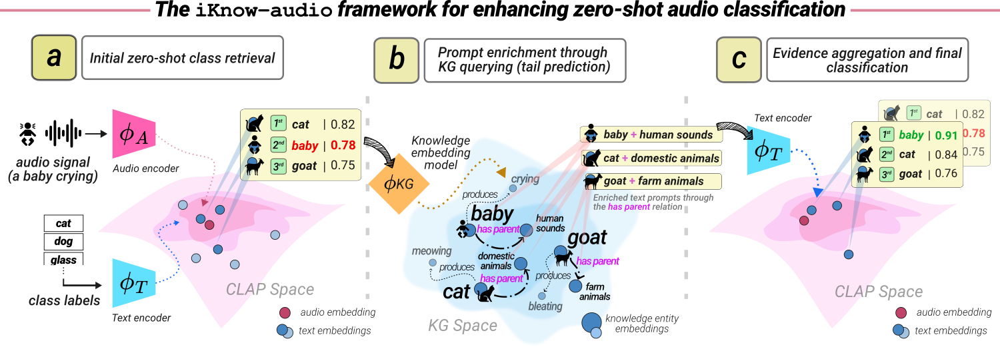

# iKnow-audio: Integrating Knowledge Graphs with Audio-Language Models

This repository contains the implementation and resources for the paper:

> **iKnow-audio: Integrating Knowledge Graphs with Audio-Language Models**  
> Michel Olvera, Changhong Wang, Paraskevas Stamatiadis, Gaël Richard, Slim Essid  
> *The 2025 Conference on Empirical Methods in Natural Language Processing (EMNLP 2025), Suzhou, China.*  
> [📄 Paper (HAL)](https://hal.science/hal-05288458v1)

---


## 🧠 Overview

**iKnow-audio** is a framework that integrates **Knowledge Graphs (KGs)** with **audio-language models** such as **CLAP** to enhance zero-shot audio understanding.  
It introduces the **Audio-centric Knowledge Graph (AKG)**: a structured graph encoding semantic, causal, and taxonomic relations among everyday sound events.

**Key contributions**:
- **iKnow-audio framework:** Combines CLAP with knowledge graph embeddings for context-aware audio reasoning.  
- **Audio-centric Knowledge Graph (AKG):** A domain-specific KG derived from SALT taxonomy and LLM-based generation.  
- **CLAP-KG pipeline:** Refines CLAP predictions using relational knowledge to improve semantic grounding and robustness.  
- **Comprehensive evaluation:** Zero-shot classification across six benchmark datasets (ESC50, UrbanSound8K, TUT2017, FSD50K, AudioSet, DCASE17-T4).

---

## ⚙️ Features

- Post-hoc refinement of audio-language model predictions using structured knowledge  
- Knowledge graph embedding with **RotatE** and related models via [PyKEEN](https://github.com/pykeen/pykeen)  
- Plug-and-play reasoning compatible with any CLAP-based system  
- Transparent and interpretable reasoning through entity–relation enrichment  

---

## 📦 Repository Structure
    .
    ├── AKG_dataset/
    │   ├── AKG_pruned.tsv/        # Raw AKG triples (noisy)
    │   ├── AKG_raw.tsv/           # Curated/pruned (clean) AKG triples
    │   └── AKG_test.tsv/          # Test AKG triples
    ├── KGE_training/               
    │   ├── config.py              # Configuration file to train KGE models
    │   └── train_KGE.py           # Trained/serialized KGE models (e.g. RotatE)
    ├── requirements.txt           # Python deps (PyKEEN, CLAP, etc.)
    └── README.md                  # This file

---

## Quick start

1. Create a conda environment and install dependencies:
    ```
        conda create -n iknow-audio python=3.10 -y
        conda activate iknow-audio
        pip install -r requirements.txt
    ```
2. Train a Knowledge Graph Embedding (KGE) model using configuration ID 001 from `KGE_training/config.py`:
    ```
        python KGE_training/train_kge.py --conf_id 001
    ```
---

## Design Notes

- The CLAP-KG pipeline is **post-hoc**: it refines CLAP predictions at inference time and does **not** require fine-tuning CLAP.  
- Default KGE backbone: **RotatE** (best performance on AKG in the paper).  
- Prompt enrichment: top-k CLAP labels → query KGE (selected relations) → concatenate label + predicted tails → CLAP text-encoding → aggregate via log-sum-exp fusion.  
- The AKG exists in two variants: `raw` (noisy) and `pruned` (LLM verification + manual curation). Use `AKG_pruned` for best-quality results.

---

## Citation

If you use our audio-centric knowledge graph (AKG) or code, please cite:

    @inproceedings{olvera2025iknowaudio,
      title={iKnow-audio: Integrating Knowledge Graphs with Audio-Language Models},
      author={Olvera, Michel and Wang, Changhong and Stamatiadis, Paraskevas and Richard, Gaël and Essid, Slim},
      booktitle={Proceedings of the 2025 Conference on Empirical Methods in Natural Language Processing (EMNLP)},
      year={2025},
      address={Suzhou, China},
      url={https://hal.science/hal-05288458v1}
    }

---
